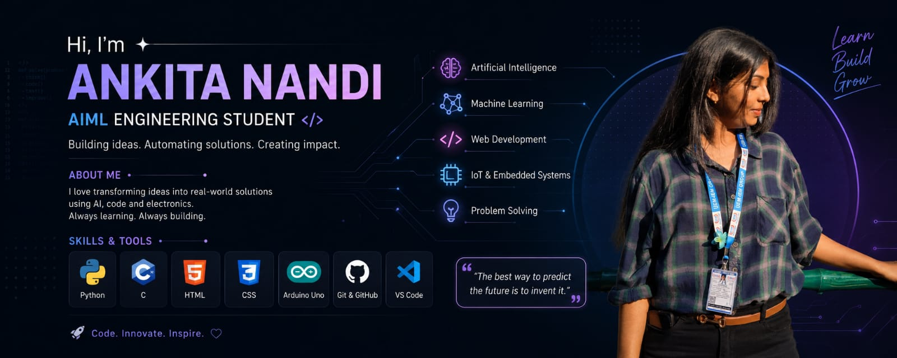

  

## 👩‍💻 About Me

Hi! I'm **Ankita Nandi**, an AIML Engineering Student passionate about
Artificial Intelligence, Machine Learning, Web Development, and IoT.

- 🤖 Exploring Artificial Intelligence & Machine Learning
- 🐍 Learning Python and C programming
- 🌐 Building with HTML & CSS
- 🔌 Working with Arduino & Embedded Systems
- 🚀 Turning ideas into real-world projects
- 📚 Always learning. Always building.

---

## 🛠️ Skills & Tools

---

## 🚀 What I'm Working On

- 🤖 AI & Machine Learning projects
- 🌐 Web development projects
- 🔌 Arduino & IoT experiments
- 💡 Beginner-friendly programming projects

---

## 📌 Featured Projects

| Project | Description |
|---|---|
| 🤖 AI Project | Coming soon |
| 🌐 Web Project | Coming soon |
| 🔌 Arduino Project | Coming soon |

---

## 🌱 Currently Learning

`Python` • `C` • `AI` • `Machine Learning` • `HTML` • `CSS` • `IoT`

---

## 💫 My Goal

> **Learn → Build → Improve → Innovate 🚀**

---

## 📫 Connect With Me

  

---

  ⭐ Thanks for visiting my profile! ⭐

